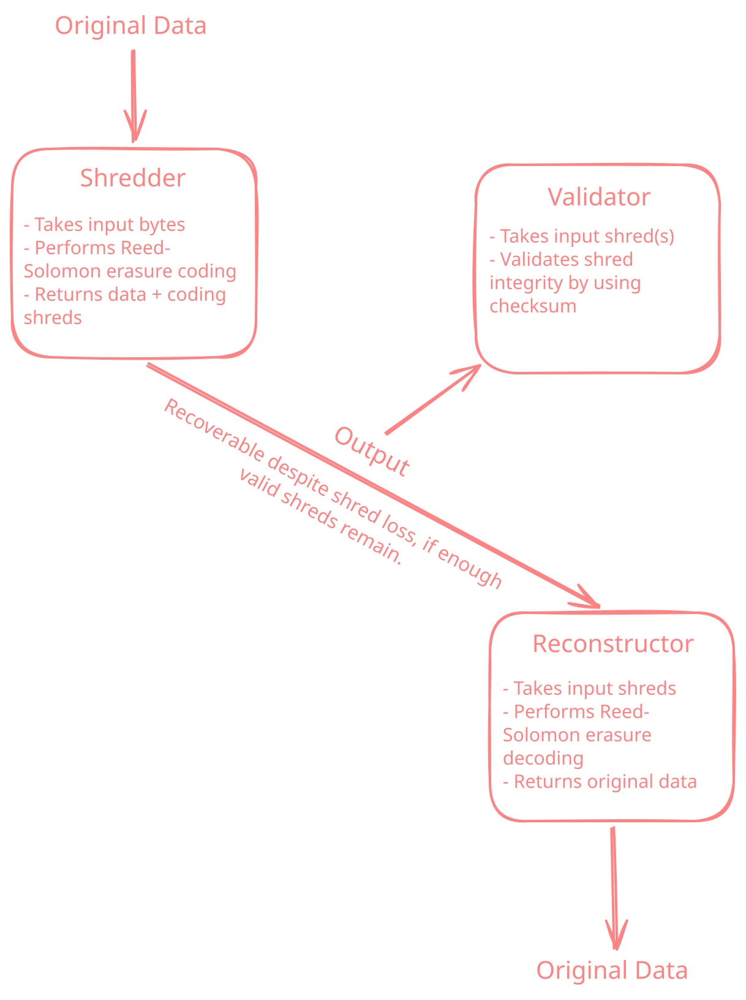

<h1 align="center">shred-codec</h1>

`shred-codec` is a rust library for shredding and reconstructing data using Reed-Solomon erasure coding. It takes raw bytes, splits them into data and coding shreds, validates their checksums, and recovers the original data when enough valid shreds remain in each group.

  

